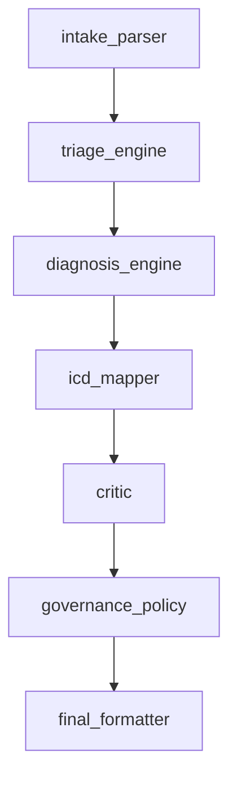

# MED-SCRIBE Architecture

This project implements a governed AI reasoning pipeline for clinical intake simulation.

## Pipeline

## Interpretation

The pipeline demonstrates a hybrid reasoning pattern:

• upstream nodes generate structured reasoning outputs
• the critic evaluates output quality
• the governance layer applies deterministic policy thresholds
• the final formatter produces a governed decision artifact

This design shows how probabilistic reasoning can be constrained before reaching a final decision.
